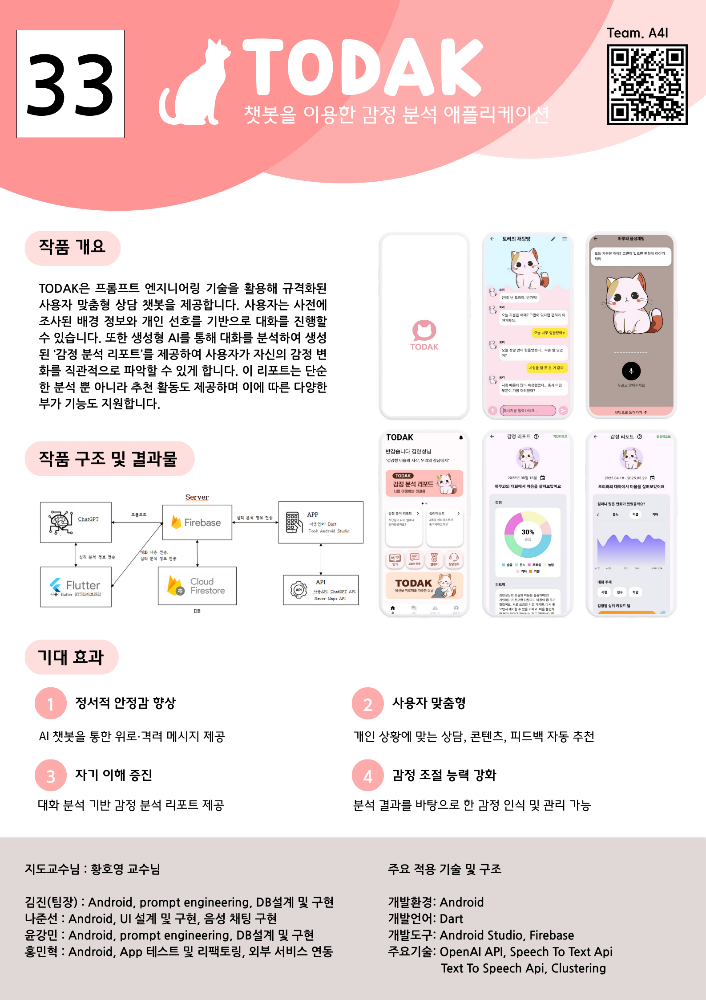
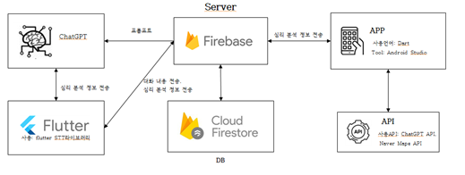
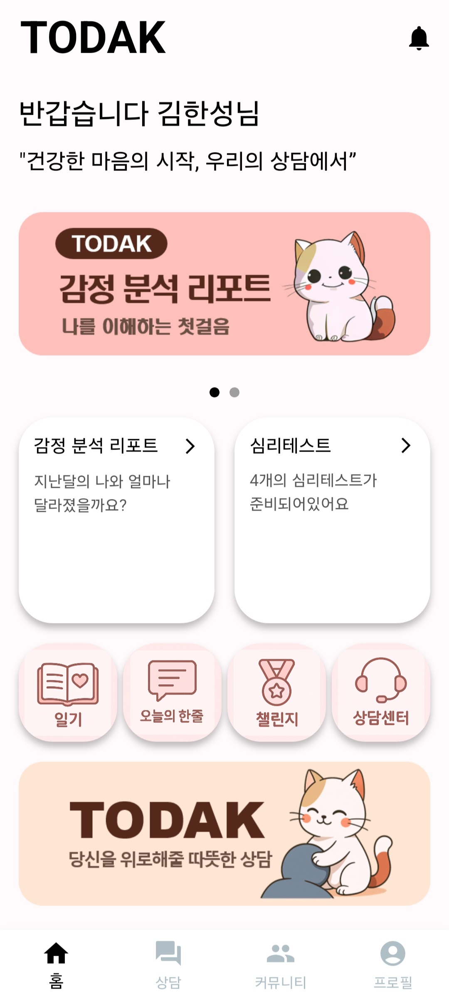
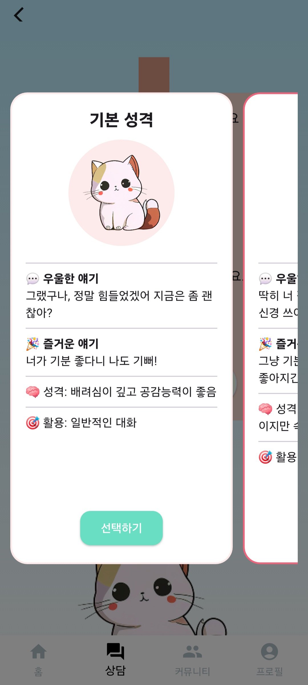
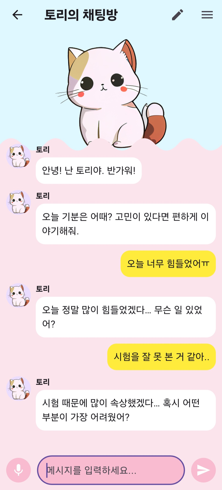
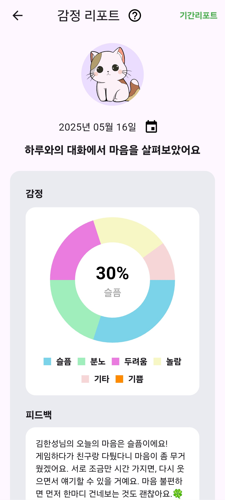
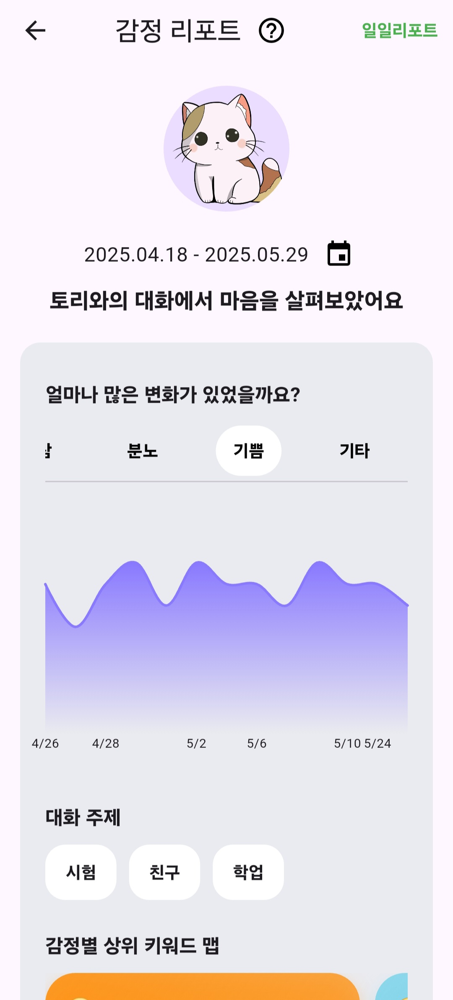
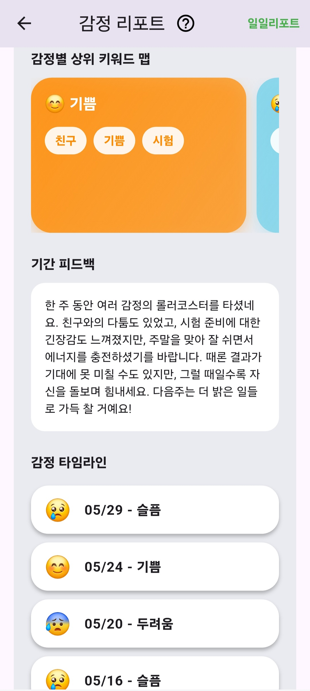

# 🐾 TODAK - 챗봇을 이용한 감정 분석 애플리케이션

> 정서적 안정과 자가 인식 능력 향상을 위한 AI 감정 분석 챗봇 앱

---

## 📽️ 시연 영상

※ 클릭 시 시연 영상 재생

---

## 📘 프로젝트 개요

TODAK은 프롬프트 엔지니어링과 AI 기반 감정 분석 기술을 활용한 모바일 상담 앱입니다. 사용자의 대화 데이터를 분석하여 감정 리포트를 생성하고, 이에 따라 맞춤형 피드백과 콘텐츠를 제공합니다.

- 🎯 목적: 사용자의 감정 상태 인식 및 조절 능력 향상
- 🤖 기능: AI 챗봇 대화, 감정 분석, 음성 인식, 리포트 제공
- 🧠 기술 스택: Flutter, Firebase, OpenAI API, Google Cloud TTS API, Flutter STT API

---

## 🛠️ 사용 기술 및 구조

| 분야 | 사용 기술 |
|------|-----------|
| 플랫폼 | Android (Flutter) | 
| 백엔드 | Firebase, Firestore |
| AI 분석 | OpenAI API, 감정 클러스터링 |
| 음성 처리 | Flutter Speech to Text API, Cloud Text to Speech API |
| 데이터 시각화 | 리포트 그래프 및 피드백 UI |

---

## 📲 주요 기능 스크린샷

| 홈 화면 | 챗봇 | 챗봇 대화 |
|:--:|:--:|:--:|
|  |  |  |

### 리포트
| 일일 리포트 | 기간 리포트 | 상세 |
|:--:|:--:|:--:|
|  |  |  |

---

## 🔍 기대 효과

1. **정서적 안정감 향상** – AI 챗봇을 통한 위로와 공감
2. **사용자 맞춤형 피드백** – 대화 및 감정에 기반한 다양한 콘텐츠 추천
3. **자가 인식 능력 증진** – 감정 리포트를 통한 자기 성찰
4. **감정 조절력 강화** – 분석 결과 기반 인식 및 관리

---

## 📂 프로젝트 구성 파일

- `/lib`: Flutter 앱 소스 코드
- `/assets`: 이미지 리소스
- `/videos`: 시연 영상
- `/images`: 포스터, 스크린샷, 구조도 등

---

## 👨‍👩‍👧‍👦 팀원 소개

| 이름 | 역할 | 주요 담당 | 연락 |
|------|------|-----------|-----------| 
| 김진(팀장) | PM, DB설계 | Android, prompt engineering | [github](https://github.com/KIMjjjjjjjj) |
| 나준선 | 음성 채팅, UI | Flutter, STT, TTS | [github](https://github.com/junsunna) |
| 윤강민 | 감정 분석, API | OpenAI API 연동, DB 리포트 | [github](https://github.com/GMYUN) |
| 홍민혁 | 테스트, 외부 연동 | 앱 테스트 및 외부 서비스 통합 | [github](https://github.com/Leis0913) |

---

## 🤝 향후 발전 방향 (Roadmap)

- [ ] 대화 데이터를 통한 일기 생성 및 수정
- [ ] 일기 기능과 감정 변화 분석 연동
- [ ] 서브 컨텐츠의 레벨 단위 디테일 구현
- [ ] 사용자 음성 분석을 통한 어조 분석

---

### 📌 참고 사항
- 본 프로젝트는 한성대학교 컴퓨터공학부 캡스톤 디자인으로 팀 프로젝트로 진행되었으며, 상업적 용도는 아님.
